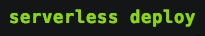

# Jim's ClojureScript Bakery
A Multiplatform Ecommerce Browser App For Kontor Bakery Made With ClojureScript, Reagent, And Re-frame! 

Check out the live demo!  https://jimtheman.github.io/Jims-ClojureScript-Bakery





Scaffolded with:


```
lein new re-frame bakery-app +cider +test +garden +less +trace +re-frisk
```

## Development Mode

### Start Cider from Emacs:

For Emacs config file:

```
(setq cider-cljs-lein-repl
	"(do (require 'figwheel-sidecar.repl-api)
         (figwheel-sidecar.repl-api/start-figwheel!)
         (figwheel-sidecar.repl-api/cljs-repl))")
```

Navigate to a clojurescript file and start a figwheel REPL with `cider-jack-in-clojurescript` or (`C-c M-J`)

### Compile css:

Compile css file once.

```
lein garden once
```

Automatically recompile css file on change.

```
lein garden auto
```

### Compile css:

Compile css file once.

```
lein less once
```

Automatically recompile css file on change.

```
lein less auto
```

### Run application:

```
lein clean
lein figwheel dev
```

Figwheel will automatically push cljs changes to the browser.

Wait a bit, then browse to [http://localhost:3449](http://localhost:3449).

### Run tests:

```
lein clean
lein doo phantom test once
```

The above command assumes that you have [phantomjs](https://www.npmjs.com/package/phantomjs) installed. However, please note that [doo](https://github.com/bensu/doo) can be configured to run cljs.test in many other JS environments (chrome, ie, safari, opera, slimer, node, rhino, or nashorn).

## Production Build


To compile clojurescript to javascript:

```
lein clean
lein cljsbuild once min
```
